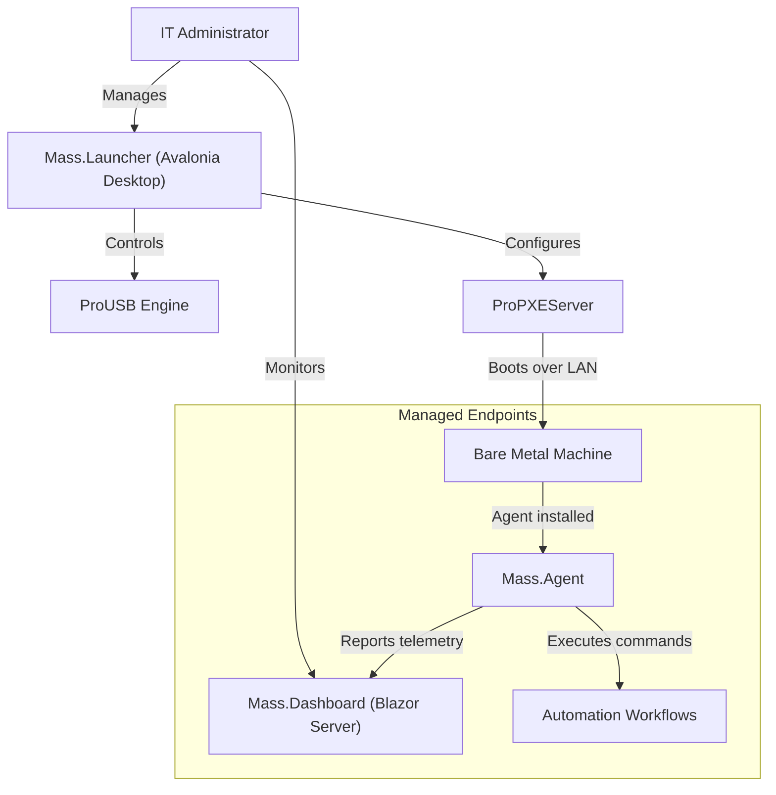

<div align="center">

# 🚀 Mass Suite

**The Gold Standard for IT Deployment & Automation**

[](https://dotnet.microsoft.com/)
[](https://docs.microsoft.com/dotnet/csharp/)
[](https://avaloniaui.net/)
[](https://dotnet.microsoft.com/apps/aspnet/web-apps/blazor)
[](LICENSE)
[](tests/)

**[Features](#-features) · [Architecture](#-architecture) · [Quick Start](#-quick-start) · [Project Structure](#-project-structure) · [Contributing](#-contributing)**

</div>

---

## 💡 Why Mass Suite?

Mass Suite replaces the fragmented tool belt of IT professionals. No more juggling Rufus, Tftpd32, and ad-hoc scripts. One platform handles USB creation, network booting, remote monitoring, and endpoint automation — with a unified design system that looks as good as it performs.

| Pillar | What it means |
|--------|---------------|
| **Unified** | One dashboard for all deployment tasks |
| **Modern** | Built on **.NET 10** and **Avalonia UI** — bleeding-edge stack |
| **Extensible** | Plugin system and Lua scripting without recompiling core |
| **Observable** | OpenTelemetry built-in for enterprise-grade tracing |

---

## ✨ Features

<table>
<tr>
<td width="50%">

### 💾 ProUSB
**The Ultimate Bootable Media Tool**
- Burn Windows/Linux ISOs to USB with zero friction
- Write to multiple drives simultaneously (parallel burning)
- Auto-handles UEFI/BIOS and large files (Split WIM)
- Verifies write integrity after every operation

</td>
<td width="50%">

### 🌐 ProPXEServer
**Network Boot Reimagined**
- Zero-touch network deployment over LAN
- Integrated DHCP, TFTP, and HTTP servers — no external dependencies
- Authentication and policy enforcement for network boots
- HTTP Boot support for optimized large-file transfers

</td>
</tr>
<tr>
<td width="50%">

### 🤖 Mass.Agent
**Intelligent Endpoint Agent**
- Real-time telemetry: CPU, RAM, uptime
- Remote command execution (PowerShell/Bash) via SignalR
- Workflow engine for complex automation sequences (Install → Join Domain → Reboot)

</td>
<td width="50%">

### 📊 Mass.Dashboard
**Blazor Server Web Portal**
- Centralized view of all managed endpoints
- Agent telemetry aggregation and status monitoring
- Accessible from any browser on the network

</td>
</tr>
</table>

---

## 🏗️ Architecture

Mass Suite uses a modular **Client–Server–Agent** topology:



---

## 🚀 Quick Start

### Prerequisites

| Requirement | Details |
|-------------|----------|
| **OS** | Windows 10/11 or Windows Server |
| **Runtime** | [.NET 10 Runtime](https://dotnet.microsoft.com/download) (or SDK to build from source) |
| **Privileges** | Administrator rights required for USB formatting and port binding |

### Build from Source

```bash
git clone https://github.com/tomytate/Mass.git
cd Mass
dotnet build
```

### Run a Component

```bash
# Desktop launcher (Avalonia UI)
dotnet run --project src/Mass.Launcher

# Web dashboard (Blazor Server)
dotnet run --project src/Mass.Dashboard

# CLI tool
dotnet run --project src/Mass.CLI

# Background agent
dotnet run --project src/Mass.Agent
```

---

## 🗂️ Project Structure

```
Mass/
├── src/
│   ├── Mass.Core/           # Shared business logic, workflow engine, plugin infrastructure
│   ├── Mass.Spec/           # Shared contracts, DTOs, and interfaces
│   ├── Mass.Launcher/       # Avalonia UI desktop entry point
│   ├── Mass.Dashboard/      # Blazor Server web admin portal
│   ├── Mass.Agent/          # Remote deployment agent (SignalR connectivity)
│   ├── Mass.CLI/            # Command-line interface for scripting & automation
│   ├── Mass.UI.Shared/      # Unified design system components
│   ├── ProUSB/              # USB bootable media creation engine
│   └── ProPXEServer/        # Network boot server (DHCP + TFTP + HTTP)
├── tests/                   # Test projects (80/83 passing)
├── docs/                    # Architecture, API reference, operations manual
├── scripts/                 # Utility scripts
├── workflows/               # CI/CD workflow definitions
├── Mass.sln                 # Solution file
├── global.json              # .NET SDK version pin (10.0.100)
└── Directory.Build.props    # Shared MSBuild properties
```

---

## 🤝 Contributing

We welcome contributions! Please read our [Contributing Guide](CONTRIBUTING.md) before opening a pull request.

### Development Setup

```bash
git clone https://github.com/tomytate/Mass.git
cd Mass
dotnet build
dotnet test
```

See [docs/](docs/) for architecture documentation, API reference, security guidelines, and the operations manual.

---

## 📄 Changelog

See [CHANGELOG.md](CHANGELOG.md) for a full history of releases.

---

## 📜 License

Released under the [MIT License](LICENSE).

---

<div align="center">
  <b>Built with ❤️ by Tomy Tate</b>
</div>
