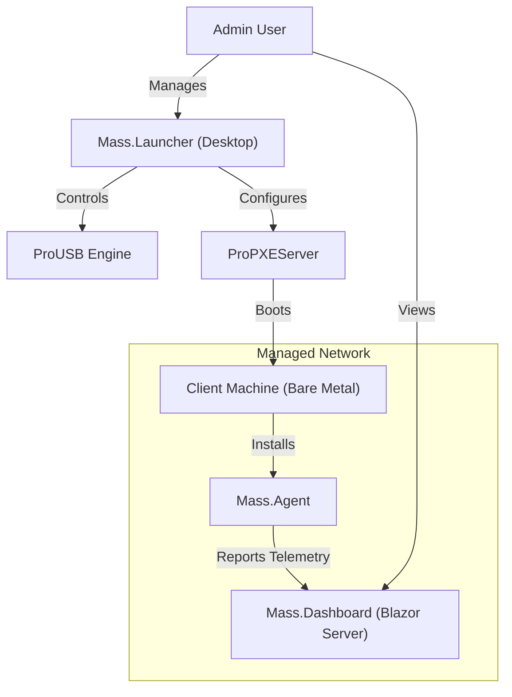

# 🚀 Mass Suite

<div align="center">


[](https://dotnet.microsoft.com/)
[](https://docs.microsoft.com/dotnet/csharp/)
[](LICENSE)
[](https://github.com/tomytate/Mass/actions)
[](tests/)

**[Features](#-features) • [Quick Start](#-quick-start) • [Architecture](#-architecture) • [Contributing](#-contributing)**

</div>

---

## 💎 The Gold Standard in IT Management

**Mass Suite** is a unified, premium ecosystem designed to replace the fragmented "tool belt" of IT professionals. It consolidates USB burning, Network Boot (PXE), and Remote Monitoring into a single, cohesive platform suitable for enterprise environments.

No more switching between Rufus, Tftpd32, and random scripts. Mass Suite does it all, with style.

### 🌟 Why Mass Suite?
- **Unified**: One dashboard for all your deployment needs.
- **Modern**: Built on the bleeding edge of **.NET 10** and **Avalonia UI**.
- **Extensible**: A robust Plugin and Scripting (Lua) engine.
- **Beautiful**: A "Gold Standard" UI that looks as good as it performs.

---

## ✨ Features

<table>
<tr>
<td width="50%">

### 💾 ProUSB
**The Ultimate Bootable Media Tool**
- **ISO to USB**: Burn Windows/Linux ISOs with zero friction.
- **Parallel Burning**: Write to multiple drives simultaneously.
- **Smart Formatting**: Auto-handles UEFI/BIOS and large files (Split WIM).
- **Validation**: Verifies integrity after every write.

</td>
<td width="50%">

### 🌐 ProPXEServer
**Network Boot Reimagined**
- **Zero-Touch Deployment**: Boot machines over LAN seamlessly.
- **Integrated Stack**: Built-in DHCP, TFTP, and HTTP servers. No external dependencies.
- **Secure**: Authentication and Policy enforcement for network boots.
- **Fast**: Optimized file transfer protocols (HTTP Boot support).

</td>
</tr>
<tr>
<td width="50%">

### 🤖 Mass.Agent
**Intelligent Endpoint Monitoring**
- **Real-Time Telemetry**: Monitor CPU, RAM, and Uptime instantly.
- **Command & Control**: Execute remote commands (PowerShell/Bash) via SignalR.
- **Workflow Engine**: Run complex automation sequences (e.g., "Install Office -> Join Domain -> Reboot").

</td>
<td width="50%">

### 🧩 Extensibility
**Built for Developers**
- **Plugin System**: Add new features without recompiling the core.
- **Lua Scripting**: Customize logic with lightweight scripts.
- **OpenTelemetry**: Enterprise-grade observability and tracing built-in.

</td>
</tr>
</table>

---

## 🏗 Architecture

Mass Suite employs a modular **Client-Server-Agent** topology:



---

## 🚀 Quick Start

### Prerequisites
- **OS**: Windows 10/11 or Windows Server.
- **Runtime**: [.NET 10 Runtime](https://dotnet.microsoft.com/download) (or SDK to build).
- **Privileges**: Administrator rights are required for USB formatting and Port binding.

### 📦 Installation

#### Option A: Build from Source
```bash
git clone https://github.com/tomytate/Mass.git
cd Mass
dotnet build
```

#### Option B: Run the Launcher
```bash
cd src/Mass.Launcher
dotnet run
```

### ⚡ Common Commands

| Component | Command | Description |
|-----------|---------|-------------|
| **Launcher** | `dotnet run --project src/Mass.Launcher` | Starts the main Desktop UI. |
| **CLI** | `dotnet run --project src/Mass.CLI` | Runs the command-line tool. |
| **Agent** | `dotnet run --project src/Mass.Agent` | Starts the background agent service. |
| **Dashboard** | `dotnet run --project src/Mass.Dashboard` | Starts the Blazor Server web dashboard. |

---

## 🤝 Contributing

We welcome contributions! Please read our [Contributing Guide](CONTRIBUTING.md) to get started.

### Project Structure
```
src/
├── Mass.Core/          # Shared business logic and abstractions
├── Mass.Spec/          # Shared contracts, DTOs and interfaces
├── Mass.Launcher/      # Main Avalonia UI desktop entry point
├── Mass.Dashboard/     # Blazor Server web admin portal
├── Mass.Agent/         # Remote deployment agent (SignalR)
├── Mass.CLI/           # Command-line interface
├── Mass.UI.Shared/     # Unified design system components
├── ProUSB/             # USB burning engine
└── ProPXEServer/       # Network boot server API and logic
```

---

## 📄 License
Released under the [MIT License](LICENSE).

<div align="center">
    <b>Built with ❤️ by Tomy Tate</b>
</div>
